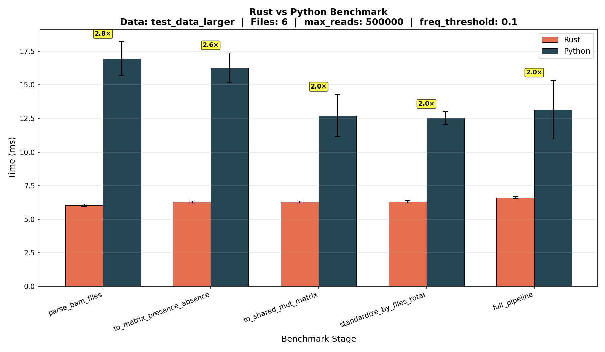

# map_to_matrix

Cluster references based on read mapping similarity.

## Approach

1. Parse BAM/SAM files to get read-to-reference mappings
2. Build distance matrix from presence/absence or match counts
3. (Optional) Build NJ tree and identify private clades

## Usage

```bash
sam_to_matrix --input-directory /path/to/bam/files [options]
```

**Key options:**

- `--input-directory` - Directory containing BAM files
- `--max-reads N` - Max reads to process (default: 500000)
- `--frequency-threshold F` - Min frequency across files (default: 0.1)
- `--threshold T` - Private reads threshold for clades (default: 0.6)
- `--cluster-analysis/--no-cluster-analysis` - Enable/disable tree & clade analysis (default: true)
- `-o, --output-directory` - Output folder (default: "output")

## Output

**Always generated:**

- `distance_matrix.tsv`
- `presence_absence_matrix.tsv`

**With `--cluster-analysis` (default):**

- `nj_tree.newick`
- `nj_tree_edges.txt`
- `all_node_statistics.tsv`
- `clade_report.tsv`
- `sample_report.tsv`

## Benchmark

The Rust implementation was benchmarked against an equivalent Python implementation
using 6 BAM files (~860 KB total, 217 reads after filtering) with default parameters
(`--max-reads 500000`, `--frequency-threshold 0.1`).

All measurements include the full parse+filter+sample step (matching Criterion's
`b.iter()` scope).



| Stage                        | Rust (ms) | Python (ms) | Speedup  |
| ---------------------------- | --------- | ----------- | -------- |
| `parse_bam_files`            | 6.0 ± 0.1 | 17.0 ± 1.3  | **2.8×** |
| `to_matrix_presence_absence` | 6.3 ± 0.1 | 16.3 ± 1.1  | **2.6×** |
| `to_shared_mut_matrix`       | 6.3 ± 0.1 | 12.7 ± 1.6  | **2.0×** |
| `standardize_by_files_total` | 6.3 ± 0.1 | 12.5 ± 0.5  | **2.0×** |
| `full_pipeline`              | 6.6 ± 0.1 | 13.2 ± 2.2  | **2.0×** |

Rust is **2–2.8× faster** than Python across all stages, with the largest gap in
BAM parsing (the most I/O-heavy stage). Matrix-only operations (post-parse) are
sub-millisecond in both languages at this scale.

### Running benchmarks

```bash
# Rust (Criterion)
cargo bench

# Python + Rust + plot
bash benchmarks/run_all.sh
```

Requirements: `cargo`, Python 3.10+, `pysam`, `numpy`, `matplotlib`.

## Acknowledgements

- [rust-phylogeny](https://github.com/RagnarGrootKoerkamp/rust-phylogeny) - Original NJ implementation
# M2M
